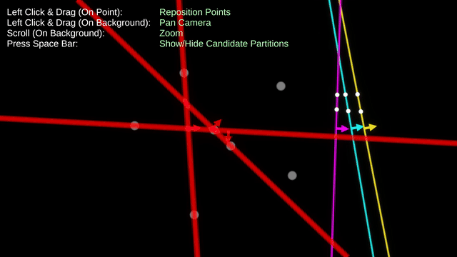
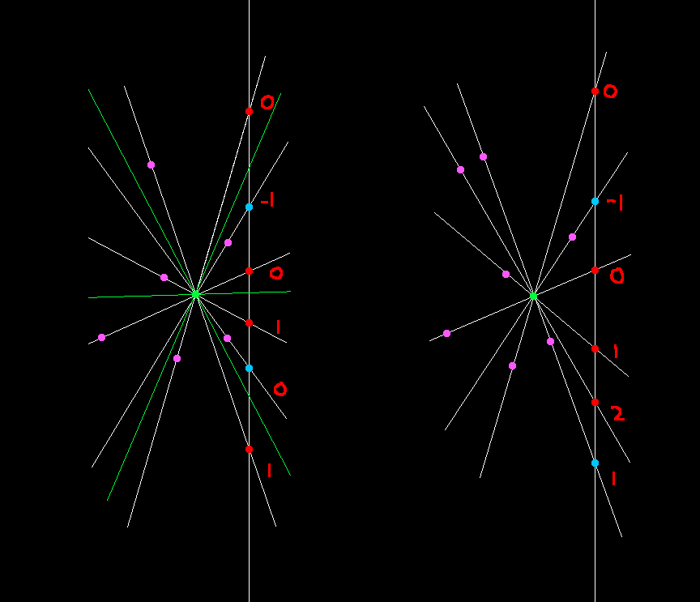

# Seven Point Partition

**Seven Point Partition** is an interactive Unity WebGL tool.

You start with seven movable points in the plane. The app continuously tries to draw three straight lines that divide them into exactly one point per region.  
Drag points to explore configurations where such a partition is possible.

For now, here's a rough sketch of the method of determining if a point can be the one in the central region of the 3 line 7 region partition.

# Counter-example
The following is a counter-example disproving my conjecture that any set of points with a 7 point partition where all 3 lines don't intersect any point has a 6 point partition where all 3 lines intersect the 7th point only.

I expect the converse should at least be true by virtue of the density of points but I should try to prove/disprove this too.

## Controls

- **Drag Point** – Move a point
- **Drag Background** – Pan camera
- **Scroll on Background** – Zoom

## Try It Online

▶️ [https://nbrader.com/SevenPointPartition/index.html](https://nbrader.com/SevenPointPartition/index.html)

## Source Code

📁 [github.com/nbrader/nbrader.com-seven-point-partition](https://github.com/nbrader/nbrader.com-seven-point-partition)

## License

MIT
