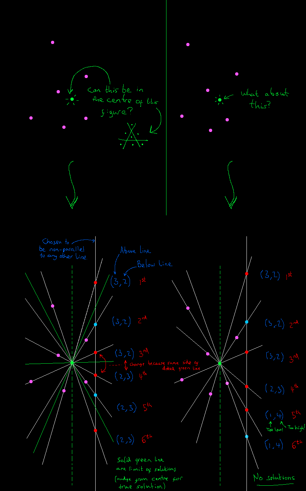

# Seven Point Partition

**Seven Point Partition** is an interactive Unity WebGL tool.  
You start with seven movable points in the plane. The app continuously tries to draw three straight lines that divide them into exactly one point per region.  
Drag points to explore configurations where such a partition is possible.

For now, here's a rough sketch of the method of determining if a point can be the one in the central region of the 3 line 7 region partition.

## Controls

- **Drag Point** – Move a point
- **Drag Background** – Pan camera
- **Scroll on Background** – Zoom

## Try It Online

▶️ [https://nbrader.com/SevenPointPartition/index.html](https://nbrader.com/SevenPointPartition/index.html)

## Source Code

📁 [github.com/nbrader/nbrader.com-seven-point-partition](https://github.com/nbrader/nbrader.com-seven-point-partition)

## License

MIT
